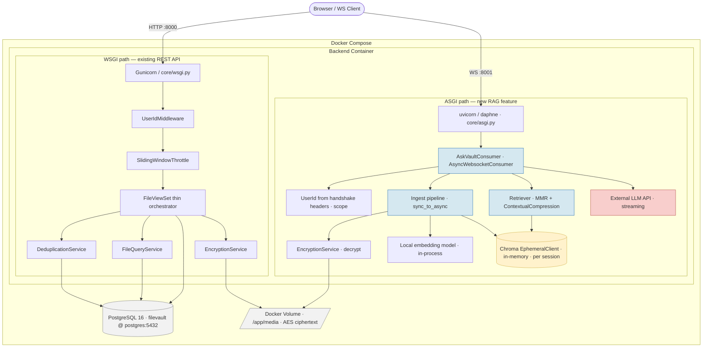
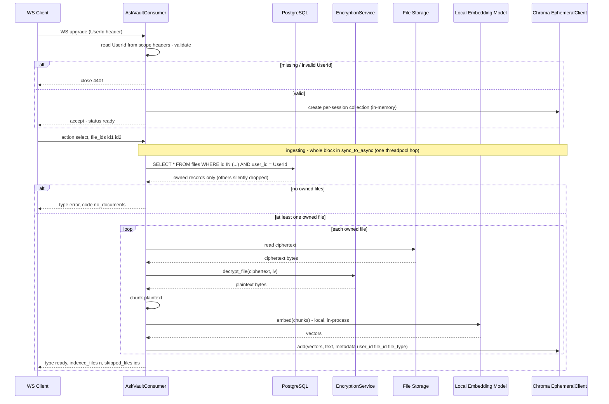
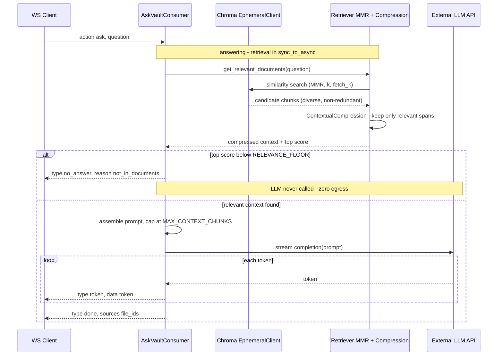
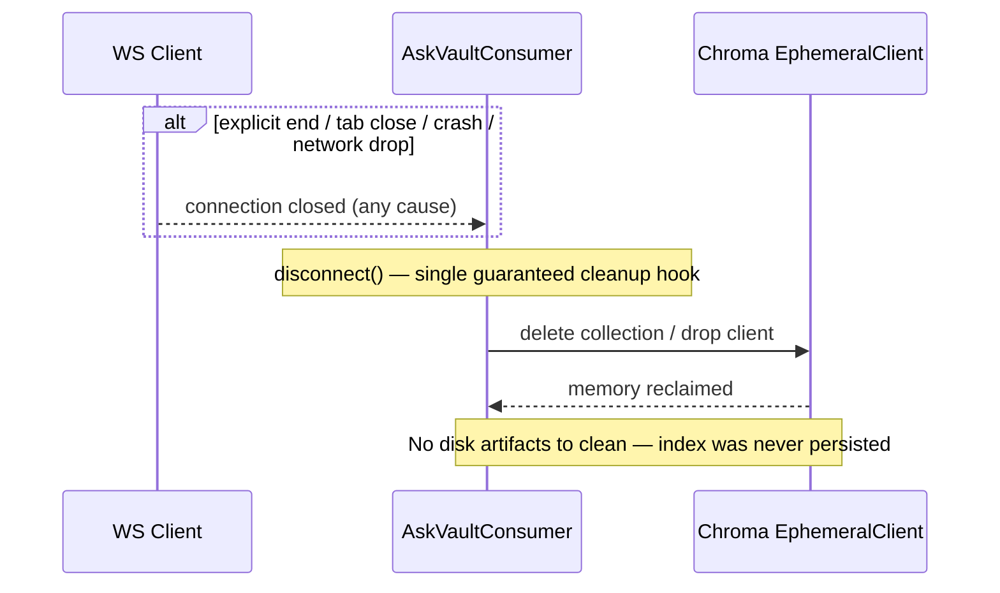

# Ask the Vault — Session-Scoped RAG over Encrypted Files

## 1. What we are trying to achieve

Add a natural-language Q&A capability on top of Abnormal File Vault: a user opens a
session, names the specific files they want to ask about, and then asks questions
whose answers are grounded *only* in those files. Answers stream back token-by-token.

The design is deliberately **session-scoped and ephemeral**. The plaintext derivatives
needed for retrieval (chunk text + embeddings) exist only in process memory, only for
the lifetime of one WebSocket connection, and are destroyed the moment the connection
closes. This maps onto a forensic "open a case → examine these documents → close the
case" workflow, and keeps the vault's per-user isolation and encryption posture intact.

Decisions locked for this iteration:

- **Transport:** a single bidirectional **WebSocket** per session (no SSE, no REST `ask`).
  One socket carries both the inbound questions and the outbound answer tokens.
- **Document selection:** the client sends an **explicit list of file IDs** at session start.
- **Embeddings:** a **local embedding model** running in-process. No external embedding API.
- **Index:** **Chroma `EphemeralClient`** — purely in-memory, per-session, never written to disk.
- **Answer LLM:** an **external LLM API** (e.g. Anthropic/OpenAI) for the generation step.
- **No rate limiting** on the WebSocket for this iteration.
- **Document set is fixed once per session** — `select` is one-shot; a second `select` is
  an error. The session's documents are immutable for its lifetime.
- **Grounding is strict** — the LLM answers *only* from retrieved context and refuses
  otherwise. No supplementing with general knowledge.
- **Single-turn** — each `ask` is independent; no conversation history is threaded.
- **Source attribution is file-level**, returned in the terminal `done` message.
- **No-answer is short-circuited** — if retrieval finds nothing above a relevance floor,
  the LLM is never called; a `no_answer` message is returned directly.

### Why WebSocket (the one-line rationale)

One WebSocket = one session = one consumer instance = one worker = one in-memory index.
The connection lifetime *is* the session lifetime, so cleanup is uniform and guaranteed:
the `disconnect` handler fires on explicit close, tab close, crash, and network drop
alike. Because the inbound questions travel over the *same* pinned connection, nothing
"floats" to a different worker — the affinity problem that a REST-`ask`-on-separate-POSTs
design would create simply does not arise.

### Two security surfaces, named honestly

These are deliberate, documented trade-offs, not oversights:

- **At-rest surface — closed.** Embeddings and chunk text live only in `EphemeralClient`
  memory for the session, so the AES-at-rest guarantee on the original files is not
  undermined by a persistent plaintext derivative on disk.
- **In-transit egress surface — open and accepted.** The answer step sends decrypted
  chunk text to an **external LLM API**. For a security product this is a real egress of
  forensic content to a third party and would, in production, warrant a data-processing
  agreement, redaction, or a self-hosted model. It is accepted here for the learning
  iteration and called out so the trade is explicit. Note the short-circuit (§5) narrows
  this surface: a question whose answer is not in the documents never reaches the external
  LLM at all, so no content egresses for unanswerable questions.

---

## 2. Architecture diagram

The REST/WSGI stack (left) is unchanged from the existing submission. The RAG feature
adds a **second serving path** on the right: an ASGI server (uvicorn/daphne) running
Django Channels, holding the WebSocket and the in-memory session index.



Legend: blue = new consumer/RAG logic, yellow = in-memory ephemeral store,
red = external egress, grey = shared persistent stores. The original `EncryptionService`
is reused by the ingest path (`ES2`) to decrypt files for chunking — no second crypto
implementation.

---

## 3. Data flow

The session moves through a small set of states, all on **one consumer instance, one
worker**. The two states that perform blocking work (ingest, ask) are the only places
that cross the async/sync boundary.

```
connect            → validate UserId from handshake headers; accept socket;
                     create per-session EphemeralClient collection (empty)
                     → state: ready

receive "select"   → { file_ids: [...] }
                     → state: ingesting   (blocking, wrapped in sync_to_async)
                       fetch File records (ORM) → ownership check (must belong to UserId)
                       → read ciphertext from /app/media → EncryptionService.decrypt
                       → chunk → embed (local model) → add to session collection
                     → send "ready"       → state: ready/asking

receive "ask"      → { question: "..." }   (rejected unless state == ready)
                     → state: answering   (retrieval blocking, wrapped in sync_to_async)
                       retriever (MMR + ContextualCompression) over session collection
                       → top score below RELEVANCE_FLOOR?
                            ├─ yes → send "no_answer" (LLM never called) → ready
                            └─ no  → assemble prompt (cap at MAX_CONTEXT_CHUNKS)
                                     → call external LLM API (streaming)
                                     → await self.send(token) for each token
                                     → send "done" {sources} → ready
                     → (loop back to ready for the next question)

disconnect         → delete collection / drop EphemeralClient → memory reclaimed
                     (fires on explicit close, tab close, crash, network drop)
```

### Async/sync boundary — the rule

Channels consumers run on **one event-loop thread shared across every connection on the
worker**. Any unwrapped blocking call freezes that thread and therefore stalls *every*
connection on the worker, not just the caller. So every line that touches the ORM, the
filesystem, the encryption library, the local embedding model, or the retriever runs
through `sync_to_async` / `database_sync_to_async`. The blocking still happens — it just
happens on a threadpool thread, off the shared event loop.

The whole ingest is wrapped as **one** `sync_to_async` unit (one threadpool hop for the
entire fetch → decrypt → chunk → embed → add pipeline), rather than wrapping each call
separately — it is logically one atomic "load these documents" operation.

---

## 4. Sequence diagrams

### 4.1 Session start + ingest



### 4.2 Ask + streamed answer



### 4.3 Session end + cleanup



---

## 5. Message protocol & prompts

All messages are JSON objects. Client→server messages carry an `action` discriminator;
server→client messages carry a `type` discriminator.

### Session state model

`select` is one-shot and `ask` is single-turn, which reduces the session to a small
state machine:

```
connected → (select) → ingesting → ready → (ask → answering → ready)* → disconnected
```

Message validity by state:

| Incoming | connected | ingesting | ready | answering |
|----------|-----------|-----------|-------|-----------|
| select   | → ingest  | error `already_selected` | error `already_selected` | error `already_selected` |
| ask      | error `no_documents` | error `not_ready` | → answer | error `busy` |

An `ask` arriving while a prior answer is still streaming is rejected with `busy` (reject,
not queue, for this iteration).

### Client → server

`select` — valid only in `connected`, exactly once:
```json
{ "action": "select", "file_ids": ["uuid1", "uuid2"] }
```

`ask` — valid only in `ready`:
```json
{ "action": "ask", "question": "What IOCs were flagged in the incident report?" }
```

Per-message validation: `action` present and known; `file_ids` a non-empty array of valid
UUID strings; `question` a non-empty string. Anything malformed → `error` code
`bad_request`.

### Server → client

`status` — between `select` and `ready`, lets the client show a spinner:
```json
{ "type": "status", "state": "ingesting" }
```

`ready` — after connect, and after ingest completes:
```json
{ "type": "ready", "indexed_files": 2, "skipped_files": ["uuid3"] }
```
`skipped_files` lists requested IDs that were not owned/found. If *all* requested files are
skipped, send `error` `no_documents` instead — the client never lands in a ready state over
an empty index.

`token` — many per answer, streamed as the LLM produces them:
```json
{ "type": "token", "data": "The " }
```

`done` — terminates a grounded answer, returns session to `ready`:
```json
{ "type": "done", "sources": ["uuid1"] }
```
`sources` is the deduplicated set of `file_id`s the retrieved context came from. With the
short-circuit in place, `done` *always* means a real grounded answer.

`no_answer` — the short-circuit terminal: retrieval found nothing above the relevance
floor, so the LLM was never called:
```json
{ "type": "no_answer", "reason": "not_in_documents" }
```
A distinct type (rather than a `done` with empty `sources`) lets the client render
"not found in your documents" without inferring it from an empty token stream.

`error` — fixed `code` enum the client branches on:
```json
{ "type": "error", "code": "not_ready", "message": "No documents selected yet." }
```

| code | When |
|------|------|
| `bad_request` | Malformed JSON, unknown action, missing/invalid fields |
| `already_selected` | A second select (one-shot violation) |
| `no_documents` | ask before select, or a select where nothing was owned/found |
| `not_ready` | ask while still ingesting |
| `busy` | ask while a previous answer is still streaming |
| `retrieval_failed` | Retriever / Chroma error |
| `llm_failed` | External LLM call failed |

`llm_failed` can fire *after* some tokens already streamed. Client contract: an answer is
complete only on `done`; an `error` may arrive instead and invalidates any partial tokens.

### Answer-phase outcomes

| Outcome | Terminal message | LLM called? |
|---------|-----------------|-------------|
| Grounded answer | `token`* then `done` | yes |
| Nothing above relevance floor | `no_answer` | no |
| Failure | `error` (`retrieval_failed` / `llm_failed`) | maybe |

### LLM prompts

Strict grounding, file-level sources, single-turn — so the prompts stay lean.

System prompt (fixed for the session):
```
You are a retrieval-grounded assistant for a secure forensic file vault.
Answer using ONLY the provided context excerpts.

Rules:
- If the context does not contain enough information to answer, say exactly
  that. Do not use outside knowledge to fill gaps.
- Do not speculate or infer beyond what the excerpts state.
- Every factual claim you make must be supported by the excerpts.
- If excerpts conflict, surface the conflict rather than resolving it silently.
- Be concise and precise. This is forensic material; a confidently wrong
  answer is worse than an admission that the documents do not cover it.
```

User prompt (assembled per ask):
```
Context excerpts:
---
{excerpt_1_text}
(source: {file_id_1})
---
{excerpt_2_text}
(source: {file_id_2})
---

Question: {question}
```

Prompt-assembly notes:

- **Sources are mechanical, not model-driven.** Because attribution is file-level, the
  model never emits sources. They are collected from retriever chunk metadata:
  `sorted(set(chunk.metadata["file_id"] for chunk in retrieved))`. Deterministic. The
  `(source: ...)` lines in the prompt aid grounding only — they are not parsed back.
- **Context cap.** Even after compression, the assembled context is capped at
  `MAX_CONTEXT_CHUNKS` so a large retrieval can't overflow the LLM context window.
- **The prompt is a control, not a guarantee.** Strict grounding is a strong nudge, not
  enforcement. The file-level `sources` list is the audit trail that lets a reviewer check
  grounding after the fact. A hard guarantee would require post-generation claim
  verification — deferred.

---

## 6. Main implementation details to note

### Serving path

- **Second serving path, not a library.** The WebSocket needs Django Channels under an
  ASGI server (uvicorn/daphne). The existing DRF REST API stays on gunicorn/WSGI,
  unchanged. Both run side by side; this is a real architectural cost, not a footnote.
- `core/asgi.py` gains a `ProtocolTypeRouter` routing `http` to the Django ASGI app and
  `websocket` to a `URLRouter` pointing at `AskVaultConsumer`.

### Auth on the handshake

- The `UserId` header rides on the WebSocket **upgrade request**, so it is available once
  at `connect()` via `self.scope["headers"]` — not through the WSGI `UserIdMiddleware`.
- Validate once at connect, store `user_id` on the consumer instance for the session's
  life. This is connection-oriented auth (validate once per connection) vs. the REST
  model's request-oriented auth (validate every request).

### Ownership enforcement

- The `select` query filters `WHERE id IN (...) AND user_id = <session user>`. File IDs
  the user doesn't own are silently dropped, never indexed. No cross-user content can
  enter the session index — the same per-user isolation the REST API enforces.

### Async/sync discipline

- Every ORM, filesystem, decryption, embedding, and retriever call is wrapped
  (`sync_to_async` / `database_sync_to_async`).
- The ORM is synchronous regardless of the PostgreSQL/`psycopg3` driver — the `a`-prefixed
  ORM methods (`aget`, `aexists`, …) are themselves threadpool wrappers, not a truly
  non-blocking DB path. Either approach keeps the event loop free; what matters is that
  nothing blocking runs unwrapped on the event-loop thread.
- Ingest is wrapped as one unit (one hop), not call-by-call.

### Index lifecycle

- `EphemeralClient` collection is created in `connect()`, populated in `select`, queried
  in `ask`, destroyed in `disconnect()`.
- Because it lives in one worker's process memory, the session is **pinned by affinity**
  to that worker — but that worker is simultaneously holding many *other* users' sessions
  (idle WebSocket connections are nearly free). The pinning guarantees the index is
  reachable for this session's questions; it does not give the session the worker to
  itself.

### Retriever construction

- Base retriever over the session collection with `search_type="mmr"` (Maximum Marginal
  Relevance) so returned chunks are diverse rather than near-duplicates — conceptually
  the retrieval-time analogue of the vault's file-level deduplication.
- Wrapped in a `ContextualCompressionRetriever` so only the relevant spans of each chunk
  reach the prompt, keeping the context sent to the external LLM small and clean.
- Metadata stored alongside each chunk (`user_id`, `file_id`, `file_type`) supports
  metadata filtering at query time and lets the `done` message report which files the
  answer drew from.
- **Relevance floor / short-circuit.** Vector search almost always returns *something* —
  it does not naturally return nothing — so an off-topic question yields the k
  least-irrelevant chunks rather than an empty result. To make "no answer" actually fire,
  the top chunk's similarity score is checked against `RELEVANCE_FLOOR`: below it, the
  consumer emits `no_answer` and never calls the LLM. This is a hard floor on the top
  score (a relative-gap refinement exists but is deferred).
- **Score-direction caveat.** Chroma returns cosine *distance* or *similarity* depending
  on configuration, and "higher is better" flips accordingly. Confirm which the collection
  uses before setting `RELEVANCE_FLOOR`, or the threshold compares backwards.

### Config constants

| Constant | Purpose |
|----------|---------|
| `RELEVANCE_FLOOR` | Min top-chunk score to proceed to the LLM; below it → `no_answer`. Empirical, tuned against the corpus + embedding model. A precision/recall dial: too strict wrongly refuses real questions, too loose lets off-topic questions reach the LLM. |
| `MAX_CONTEXT_CHUNKS` | Ceiling on chunks assembled into the prompt, so retrieval can't overflow the LLM context window. |

### Streaming

- Tokens are pushed with `await self.send(...)` as the external LLM produces them — the
  same socket carries the inbound question and the outbound stream.
- Bridging the LLM's streaming output into async `send` calls is the fiddliest part of
  the implementation (a sync generator → async iteration bridge if the client library is
  sync). Worth prototyping in isolation before wiring into the consumer.

---

## 7. Known gaps / deferred (deliberately out of scope this iteration)

- **No rate limiting on the WebSocket.** The DRF `SlidingWindowThrottle` does not apply to
  WS frames; a per-question limit inside `receive()` is deferred.
- **Re-embedding cost per session.** Embeddings are rebuilt every session start (the price
  of purely-ephemeral indexing). Acceptable for a small, local-model, low-concurrency
  workload; would need revisiting for large document sets or frequent re-opening.
- **Threadpool occupation under concurrency.** Local-model ingest occupies a threadpool
  thread for its duration. Fine at low concurrency; many simultaneous ingests could
  starve the pool. Offloading ingest to Celery is the escalation path — but note it would
  force a *shared* vector store (separate process can't share the in-memory index),
  reintroducing the at-rest surface this design closed. Not worth it at this scale.
- **External-LLM egress.** Decrypted forensic content leaves the box at answer time
  (see §1). Production would need a DPA, redaction, or a self-hosted model.
- **No persistence / resumability.** A dropped connection ends the session and discards
  the index by design; there is no "resume my session" path.
```