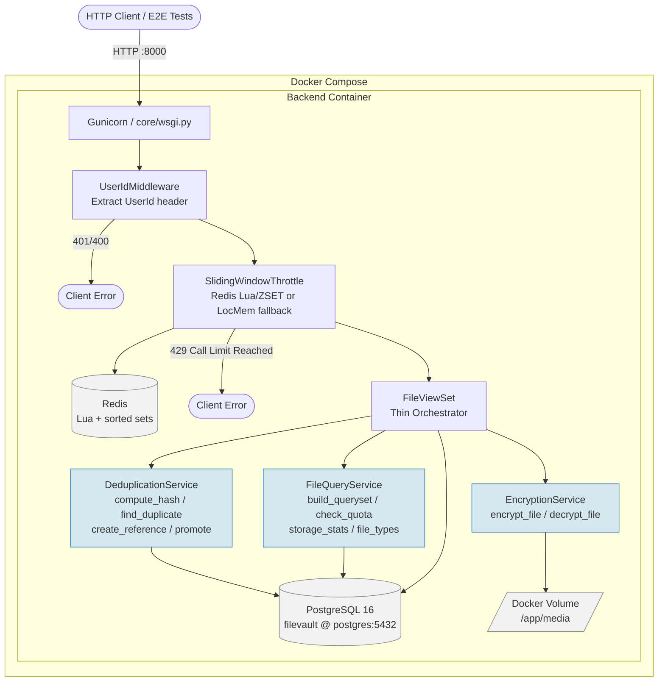
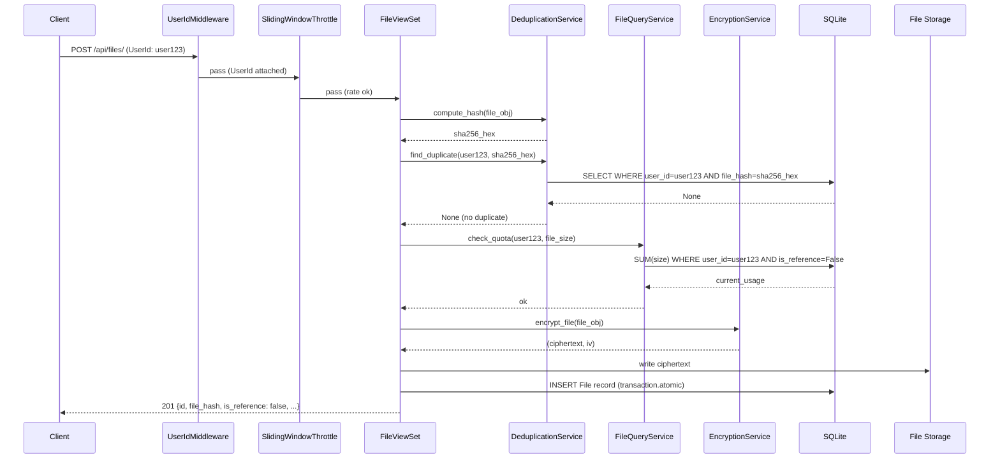
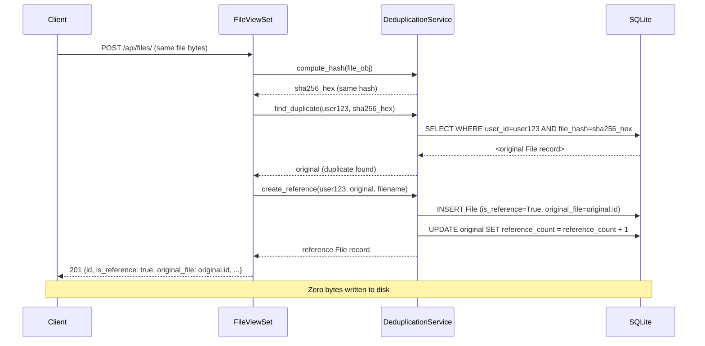
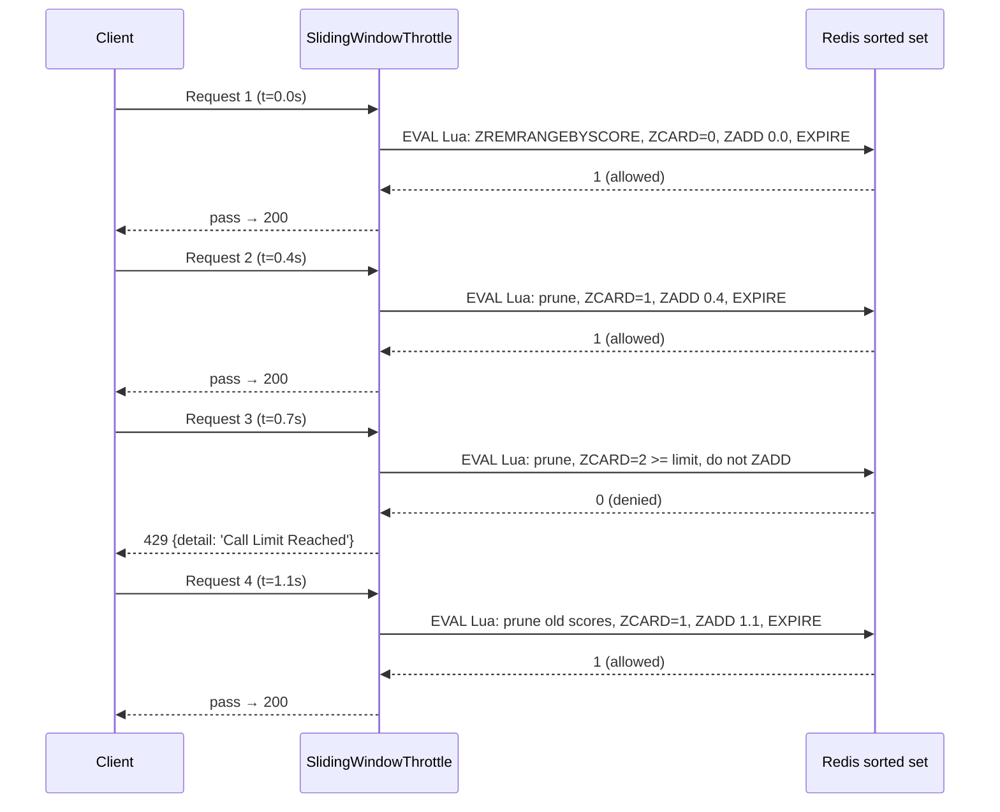
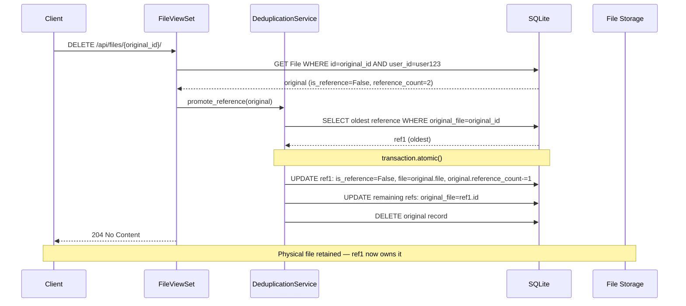
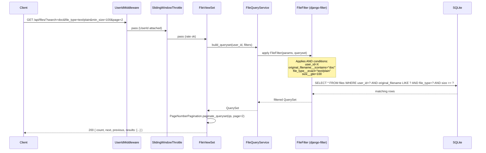
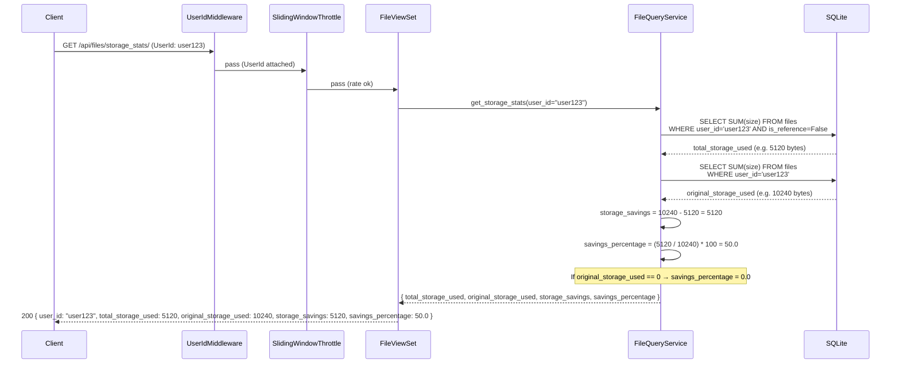
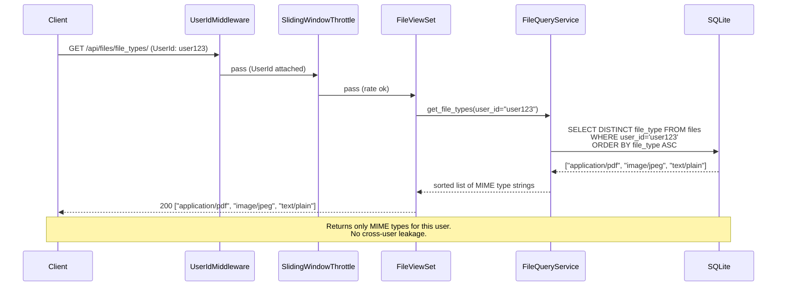
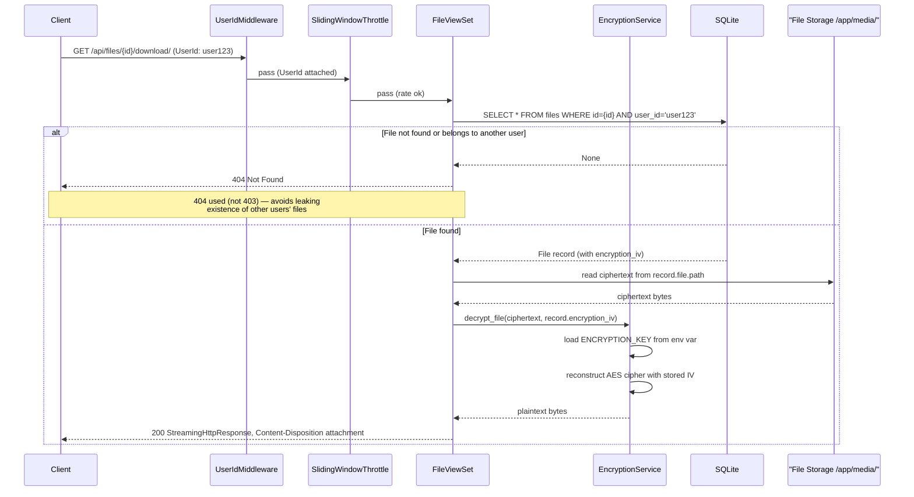

# Architecture Diagram

# Event Sequence Diagrams

## Upload — New File

## Upload — Duplicate File (Deduplication path)

## Rate Limit Breach

## Delete — Original with References

## GET /api/files/ — List Files

---

## GET /api/files/storage_stats/ — Storage Statistics

---

## GET /api/files/file_types/ — Available File Types

---

## GET /api/files/{id}/download/ — Download File

